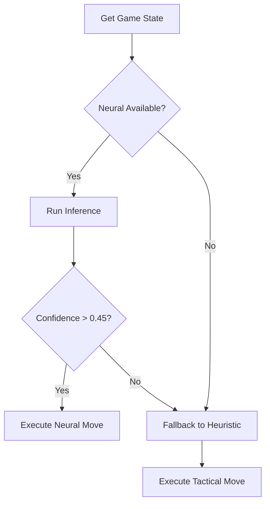

# Riftbound AI: Intelligent Agency Architecture

## 1. Decision Layers
The Riftbound AI is a multi-protocol agent designed for both speed (Heuristics) and strategic depth (Neural).

### 1.1 Heuristic Engine (Rule-Based)
- **Primary Goal**: Immediate tactical value.
- **Decision Logic**: Prioritized Tree.
    1. **Lethal Detection**: Scans unblocked strike outcomes.
    2. **Value Trading**: Calculates HP/Attack ratios for "Free trades" (surviving unit).
    3. **Mana Curbing**: Maximizes mana usage per turn to maintain board presence.

### 1.2 Neural Inference (ONNX-Web)
- **Model**: ONNX-exported Policy Network.
- **Input Vector (State Encoding)**:
    - Scalar: Turn Number, Current Mana, Health (Relative).
    - Grid: Field presence (encoded as a 2D matrix of cost/stat/keywords).
    - Hand: Bitmask of playable cards.
- **Output (Logits)**: Probabilities across the **Action Space** (Play, Attack, Pass).

## 2. The Hybrid "Sovereign" Logic
The AIService implements a "Confidence Threshold" fallback.

## 3. Personality Profiles
AI agents are injected with specific weights to simulate different playstyles:
- **Aggron (Noxus Personality)**: 1.5x weight on Face Damage, 0.5x weight on defending Nexus.
- **Stalwart (Demacia Personality)**: 1.5x weight on unit survival, 1.2x weight on board count.
- **Trickster (Ionia/Piltover)**: High priority on Spell Stack complexity and "Reactionary" plays.

## 4. Emote Psychology
The AI uses `lastConfidence` to trigger contextual UI emotes:
- **Low Confidence (<0.2)**: "Error in calculations... adapting."
- **Extreme Confidence (>0.9)**: "Your defeat is statistically certain."
- **Turnaround (Prev Confidence <0.3, Current >0.6)**: "Unforeseen variable in my favor. Pivot engaged."
